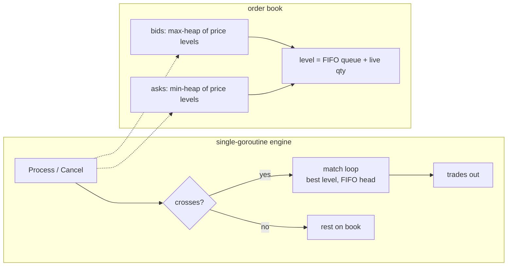

# matchbook

A stock exchange has a program at its center that pairs people who want to buy
with people who want to sell. It is called a matching engine, and it has to be
both extremely fast and completely predictable: the same stream of orders must
always produce the exact same trades, or the exchange cannot be trusted or
tested.

matchbook is my version of that core, written in Go. It handles one instrument
on one thread with no locks, which is what makes it predictable. Orders are
matched by price first and then by who got there first, big orders can fill
partially, cancelling is instant, and it can report how much buying and selling
interest sits at each price. It processes about 2 million orders per second
with a typical latency of a third of a microsecond, and it is tested by
throwing random order streams at it and checking the rules always hold.

## Features

- **Limit and market orders** with price-time (FIFO) priority and partial fills
- **Price improvement to the taker** — fills always execute at the maker's price
- **O(1) cancels** via tombstoning with lazy cleanup at the queue head
- **Aggregated depth snapshots** (top-N levels per side)
- **Allocation-conscious hot path** — the trade buffer is reused across calls;
  integer tick prices keep floats out of the matching path entirely

## Architecture



Each side of the book is a hash map of price → level plus a binary heap of
prices for best-price access. Levels are FIFO queues with an advancing head
index, so dequeue never reallocates. Emptied levels and cancelled orders are
pruned lazily when they surface at the top — cancels stay O(1) and the heap
never needs random deletion.

Scaling out is by sharding: one engine goroutine per instrument, orders routed
by symbol. Nothing in the core needs a mutex.

## Benchmarks

`go run ./cmd/bench -n 2000000` on an 8-core Intel Mac (go1.26.5), seeded
random flow (90% limit / 10% market, narrow price band for heavy crossing):

| metric | value |
|---|---|
| sustained throughput | **2.08M orders/sec** |
| latency p50 | 0.30 µs |
| latency p95 | 0.69 µs |
| latency p99 | 1.14 µs |
| trades generated | 1.72M from 2M orders |

Reproduce with a fixed seed: the flow generator is deterministic (`-seed`).

## Testing

- **Property-based suite**: 300 random scenarios × 400 operations, each
  cross-checked operation-by-operation against a naive O(n) reference
  implementation — trades, cancels, top-of-book, and final depth must be
  identical. The book-never-crossed invariant is asserted after every op.
- **Conservation property**: every unit of submitted quantity is provably
  filled, resting, cancelled, or discarded (market IOC remainder).
- Table-driven unit tests for FIFO priority, price priority, partial fills,
  price improvement, IOC semantics, cancels, and input validation.
- `go test -race -cover ./...` → **96.8% statement coverage**, race-clean.

## Usage

```go
eng := matchbook.NewEngine()

eng.Process(matchbook.Order{ID: 1, Side: matchbook.Sell, Type: matchbook.Limit, Price: 100, Qty: 10})
trades := eng.Process(matchbook.Order{ID: 2, Side: matchbook.Buy, Type: matchbook.Limit, Price: 102, Qty: 4})
// trades: [{TakerID:2 MakerID:1 Price:100 Qty:4}] — taker gets price improvement

bid, qty, ok := eng.BestBid()
depth := eng.Depth(matchbook.Sell, 5)
eng.Cancel(1)
```

## License

MIT
